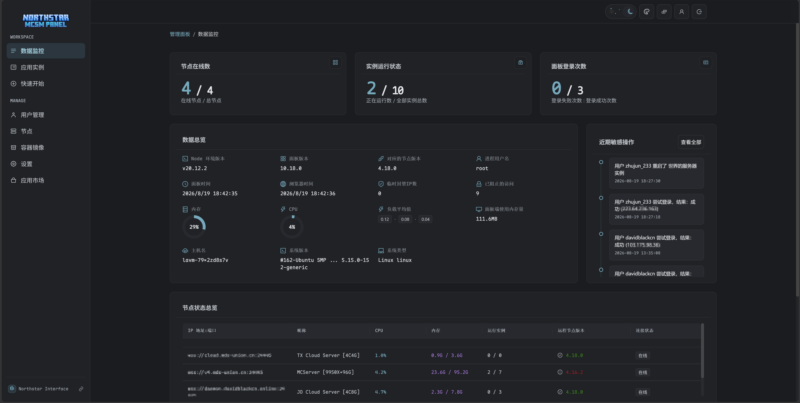

# MCSM Northstar Interface

适用于 MCSManager v10+ 版本的界面主题。

- 开发测试版本：`MCSManager 10.18.0`



## 安装

1. 从 [Releases](https://github.com/DavidBlackCN/MCSM-Northstar-Interface/releases) 下载最新 ZIP。
2. 备份 MCSM 的 `web/public` 目录。
3. 将 ZIP 内容解压到 `web/public`。
4. 在 `web/public/index.html` 的 `</head>` 前加入：

   ```html
   <link rel="stylesheet" href="./northstar-v10.css">
   ```
5. 在 `</body>` 前按以下顺序加入：

   ```html
   <script src="./northstar-v10/scripts/00-runtime-bridges.js"></script>
   <script src="./northstar-v10/scripts/01-shell-controls.js"></script>
   <script src="./northstar-v10/scripts/02-navigation-surfaces.js"></script>
   <script src="./northstar-v10.js"></script>
   ```
6. 重启 MCSManager Web 服务，并使用 `Ctrl+F5` 刷新页面。

更新 MCSManager 后需要重新执行第 3 至第 5 步。不要删除或覆盖新版本自带的 `assets`。

加载页由主题 CSS 兼容覆盖，无需手动替换 `#before-app-mounted` 的 HTML。若页面仍显示旧加载器，请确认 `northstar-v10.css` 位于 `</head>` 前，并使用 `Ctrl+F5` 清除旧缓存。

## 自定义卡片

`cards` 目录中的 HTML 文件可在“自定义布局”中作为扩展页面卡片上传。

## 文件

- `northstar-v10.css`：主题样式入口，按顺序加载 `northstar-v10/` 下的分类样式模块
- `northstar-v10.js`：主题交互启动入口，依赖 `northstar-v10/scripts/` 下的分类脚本模块
- `fonts`：Maple Mono 字体
- `img/logo.png`：侧边栏 Logo
- `cards`：可选自定义卡片

## 鸣谢

- [（MCSM 10主题）Vivid](https://blog.imlazy.ink:233/index.php/archives/335/)
